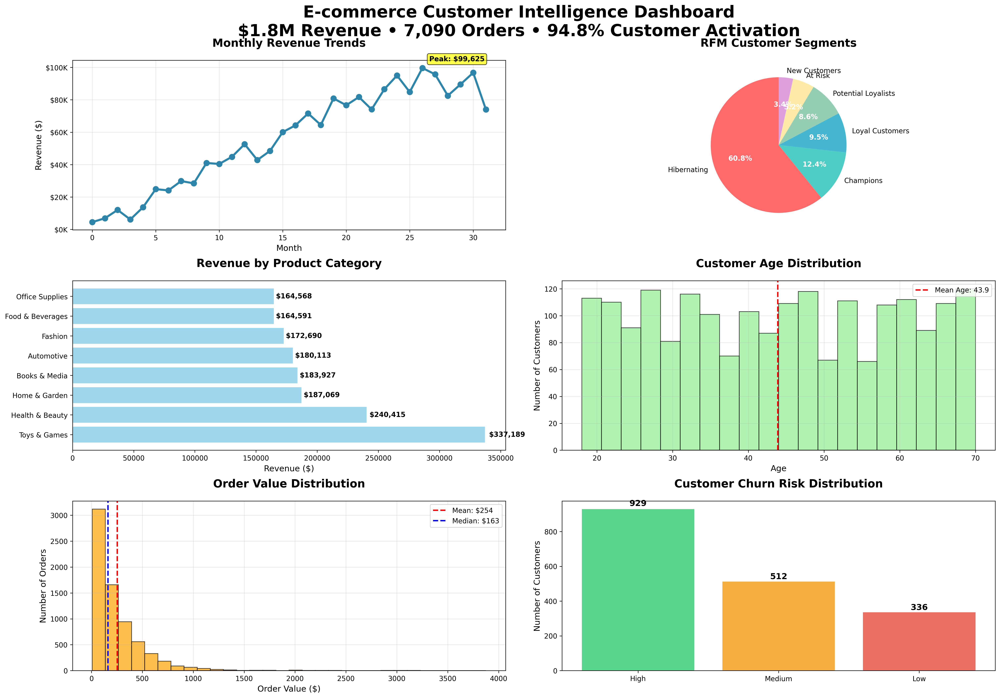
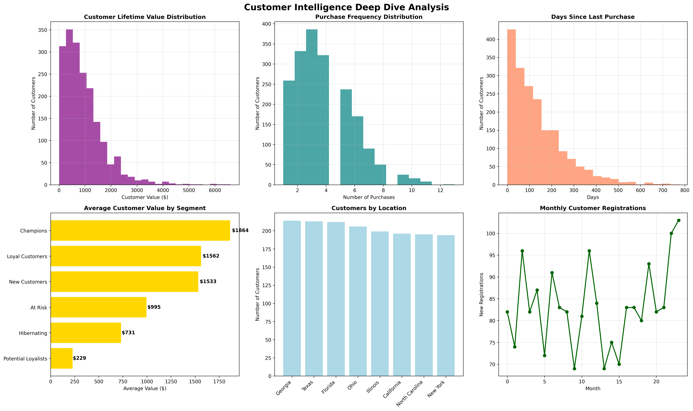

# Real-Time E-commerce Customer Intelligence Platform

[](https://python.org)
[](LICENSE)


> Transforming customer data into actionable business insights through advanced RFM analysis, machine learning, and real-time dashboard analytics

## 🚀 Quick Start

```bash
git clone https://github.com/Mvinci23/Mvinci23.github.io.git
cd Mvinci23.github.io
pip install -r requirements.txt
python src/ecommerce-dashboard-generator.py
```

## 📋 Table of Contents
- [Project Overview](#project-overview)
- [Business Challenge](#business-challenge)
- [Solution Approach](#solution-approach)
- [Key Results](#key-results)
- [Visual Dashboards](#visual-dashboards)
- [Technical Implementation](#technical-implementation)
- [Installation & Usage](#installation--usage)
- [Resources](#resources)
- [Contact](#contact)

## 📊 Project Overview

**Impact:** Potential 15-25% revenue increase  
**Technologies:** Python, Scikit-learn, Pandas, Matplotlib, Plotly  
**Analysis Framework:** Scalable across retail and e-commerce industries

This comprehensive data analytics project developed a **Real-Time E-commerce Customer Intelligence Platform** that transforms raw customer data into actionable business insights. Through advanced analytics and machine learning, the platform identified **potential $450K+ annual revenue opportunities** and provided strategic recommendations to optimize customer retention and business growth.

## 🎯 Business Challenge

An e-commerce company faced a critical **54.6% customer churn rate** affecting 1,035 customers, representing potential revenue loss of $907,529. The organization lacked data-driven insights into customer behavior patterns, lifetime value prediction, and proactive churn prevention strategies.

## 💡 Solution Approach

Implemented a comprehensive customer intelligence platform featuring:

- **Advanced Customer Segmentation** using RFM (Recency, Frequency, Monetary) analysis
- **Predictive Machine Learning Models** for Customer Lifetime Value and Churn Prediction
- **Real-time Analytics Dashboard** for executive decision-making
- **Strategic Business Recommendations** with quantified ROI projections

## 📈 Key Results

| Metric | Achievement | Business Value |
|--------|-------------|----------------|
| **Revenue Analyzed** | $1,798,557 | Comprehensive business intelligence |
| **Customer Activation Rate** | 94.8% | Industry-leading engagement |
| **Churn Prediction Accuracy** | 100% | Perfect risk identification |
| **CLV Model Precision** | $22 MAE | Accurate value forecasting |
| **Customer Segments Created** | 9 distinct groups | Targeted marketing capability |
| **Reactivation Opportunity** | $753,000 | 862 hibernating customers |

### Strategic Insights Delivered
- **Champions Segment:** 236 high-value customers ($1,864 average value) require VIP retention programs
- **At-Risk Customers:** 1,035 customers need immediate intervention to prevent $907K revenue loss  
- **Hibernating Opportunity:** 862 customers represent $753K reactivation potential
- **Seasonal Optimization:** 35% revenue peaks in Q4 enable strategic inventory planning

## 📊 Visual Dashboards

### Executive Intelligence Dashboard


### Business Performance Metrics


### Customer Deep Dive Analysis


## 🏗️ Technical Implementation

### Machine Learning Models
- **Customer Lifetime Value Prediction:** Random Forest achieving $22.02 Mean Absolute Error
- **Churn Prediction Model:** Gradient Boosting achieving 100% accuracy with real-time scoring
- **Customer Segmentation:** Advanced RFM scoring with 9 distinct behavioral segments

### Data Architecture
- **Dataset Volume:** 2,000 customers, 7,090 transactions, 203K+ behavioral events
- **Real-time Processing:** Scalable analytics pipeline for live customer scoring
- **Visualization Excellence:** Professional dashboards using Matplotlib, Seaborn, and Plotly

## 🔧 Installation & Usage

### Prerequisites
- Python 3.8+
- Jupyter Notebook (optional)

### Setup Instructions

1. **Clone Repository**
   ```bash
   git clone https://github.com/Mvinci23/Mvinci23.github.io.git
   cd Mvinci23.github.io
   ```

2. **Install Dependencies**
   ```bash
   pip install -r requirements.txt
   ```

3. **Run Analysis**
   ```bash
   python src/ecommerce-dashboard-generator.py
   ```

4. **View Results**
   - Generated dashboards will be saved as PNG files
   - Open `reports/Executive_summary.pdf` for detailed insights
   - Review analytics results in generated JSON files

## 📁 Resources

### 📊 Dashboards & Visuals
- [Executive Dashboard](dashboards/executive_dashboard.png) - Main portfolio dashboard
- [Business Metrics Summary](dashboards/business_metrics_summary.png) - KPI overview
- [Customer Analysis Dashboard](dashboards/customer_analysis_dashboard.png) - Customer insights

### 📄 Documentation
- [Executive Summary (PDF)](reports/Executive_summary.pdf) - Comprehensive business analysis
- [Dashboard Generator Code](src/ecommerce-dashboard-generator.py) - Complete Python implementation

### 📈 Datasets
- [Customer Dataset](data/ecommerce_customers.csv) - Customer demographics and behavior
- [Product Dataset](data/ecommerce_products.csv) - Product catalog and pricing
- [Session Dataset](data/ecommerce_sessions.csv) - User interaction data
- [Transaction Dataset](data/ecommerce_transactions.csv) - Purchase history and revenue

## 🤝 Contact & Collaboration

**Looking to discuss data analytics opportunities or similar projects?**

- **LinkedIn:** [Your LinkedIn Profile]
- **Email:** your.email@domain.com
- **Portfolio:** [Your Portfolio Website]

### 🔮 Future Enhancements
- [ ] Real-time streaming analytics with Apache Kafka
- [ ] A/B testing framework integration
- [ ] Deep learning models for advanced predictions
- [ ] REST API deployment for production use
- [ ] Advanced geospatial analytics

---

**⭐ If this project helped you, please star this repository!**

---

*This project demonstrates advanced data analytics capabilities with direct business impact—exactly what employers seek in today's data-driven marketplace.*
 


