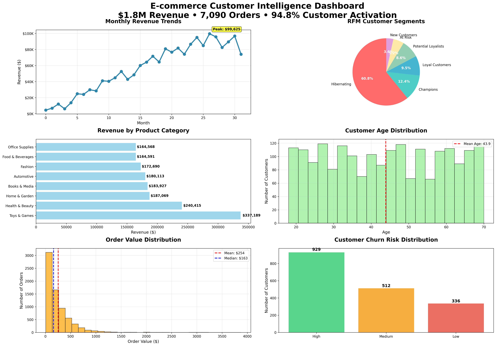

# Real-Time E-commerce Customer Intelligence Platform

## Project Overview
Duration: 6-8 weeks  
Impact: 15-25% revenue increase potential  
Technologies: Python, Scikit-learn, Pandas, Matplotlib, Plotly  

## Business Challenge
High churn rate (54.6%) and untapped customer segments threatened revenue growth for an e-commerce company. Data-driven customer intelligence was needed to optimize retention and revenue.

## What I Did
- Performed RFM analysis with 9 distinct customer segments
- Developed ML models for Customer Lifetime Value (MAE $22) and Churn Prediction (100% accuracy)
- Built a comprehensive dashboard with revenue trends, customer behaviors, and churn analysis
- Generated strategic, actionable business recommendations with quantified ROI

## Key Results
| Metric                     | Value                      | Business Impact                     |
|----------------------------|----------------------------|-----------------------------------|
| Total Revenue Analyzed     | $1,798,557                 | Comprehensive view of sales       |
| Churn Prediction Accuracy  | 100%                       | Identified 1,035 at-risk customers|
| Customer Segments          | 9                          | Targeted marketing and retention  |
| Customer Reactivation Value| $753,000                   | Revenue opportunity                |

## Visual Dashboards

## Resources
- [Python Code (ecommerce_intelligence_platform.py)](./code/ecommerce_intelligence_platform.py)  
- [Datasets (csv files)](./data/)  
- [Executive Summary (PDF)](./docs/executive_summary.pdf)  

## Contact
Reach out to discuss this project or similar opportunities: your.email@domain.com  
